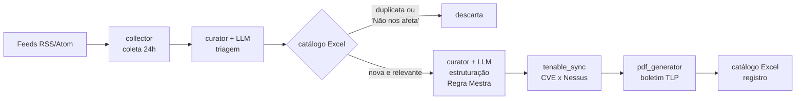
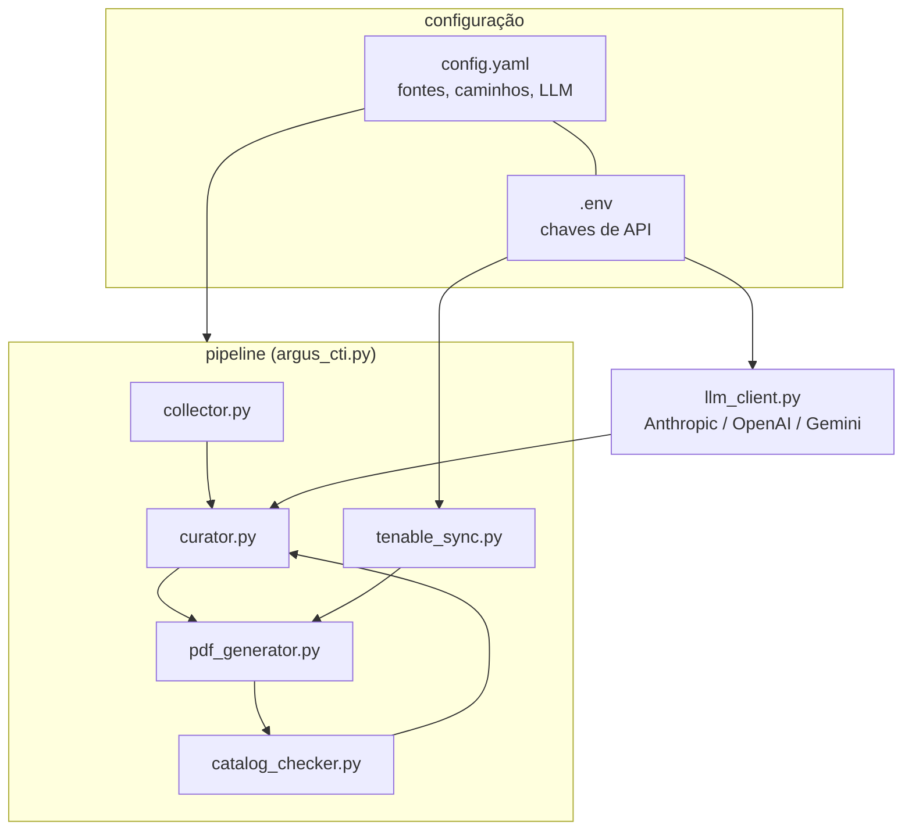

# Argus CTI

Curador diário de Cyber Threat Intelligence. Ele lê o noticiário de segurança
pelo analista, escolhe o que importa, extrai o que é acionável e entrega um
boletim PDF pronto para o time de SOC/CSIRT/DFIR começar o dia.

<p align="center">
  
</p>

## O que é

Todo time de segurança tem esse ritual: alguém abre dez portais de notícia,
separa o que é relevante, traduz, resume, procura CVE, monta a lista de IOCs
e distribui. Todo dia. É trabalho braçal, repetitivo e fácil de errar — e foi
exatamente isso que eu quis eliminar.

O Argus CTI automatiza o ritual de ponta a ponta: coleta os feeds, usa um LLM
como analista de triagem, estrutura cada notícia em um formato padrão de CTI
(resumo, mitigação, impacto, ações, CVEs, TTPs do MITRE ATT&CK, IOCs
defangados) e gera um boletim PDF com sumário executivo e classificação TLP.
O analista deixa de garimpar e passa a validar.

## O que ele faz

Coleta notícias das últimas 24h nos feeds RSS/Atom que você configurar e envia
os títulos para o LLM fazer a triagem por prioridade real de CTI: exploração
ativa, zero-days, ransomware, APTs, vazamentos e patches críticos — descartando
release de marketing e opinião sem evidência.

Para cada notícia aprovada, baixa o texto do artigo original e pede ao LLM a
estruturação completa, em português. Aqui vale a **Regra Mestra** do projeto:
TTPs e IOCs alimentam bloqueio em produção e regras de SIEM, então **nada pode
ser inventado** — o prompt restringe a extração ao texto fornecido e o código
valida tudo de forma determinística depois (formato de CVE, IDs de técnica
ATT&CK, defang forçado de domínios e URLs). Notícia sem IOC público sai com a
seção vazia, e isso é o comportamento correto.

O boletim ainda cruza as CVEs do dia com o seu ambiente, se você tiver
Tenable.io/Nessus: um snapshot diário das vulnerabilidades abertas fica em
SQLite local e, quando a CVE da notícia existe em algum ativo seu, o PDF ganha
um alerta com a contagem e a lista de hosts expostos — e o documento inteiro
sobe automaticamente de TLP:WHITE para TLP:AMBER, porque passou a conter
informação sensível do ambiente.

Por fim, tudo que foi publicado entra num catálogo Excel que funciona como
memória e como inteligência: notícias repetidas não voltam nos próximos
boletins (dedup por URL e por similaridade de título), e você pode classificar
cada tecnologia na coluna "Relevância" como *Nos afeta* / *Não nos afeta* —
o que for marcado como "Não nos afeta" some dos boletins futuros, inclusive
atualizações.

## Como faz



A arquitetura é modular de propósito — cada peça tem uma responsabilidade e
pode ser trocada sem mexer nas demais:



O ponto que mais gosto nesse desenho é o `llm_client.py`: o resto do código
não sabe qual LLM está respondendo. Trocar de Claude para GPT ou Gemini é
editar duas linhas no `config.yaml`.

## Como usar

Requisitos: Python 3.10+ e uma chave de API de qualquer um dos provedores
suportados.

```bash
git clone <este-repo> && cd argus-cti-v1
pip install -r requirements.txt

cp .env.example .env        # e preencha a chave do SEU provedor
python argus_cti.py         # gera o boletim do dia em ./reports/
```

Opções úteis:

```bash
python argus_cti.py --dry-run     # cura e mostra o JSON, sem gravar nada
python argus_cti.py --hours 48    # amplia a janela de coleta
python argus_cti.py --max-news 5  # boletim mais enxuto
python argus_cti.py --list-models # modelos disponiveis no provedor configurado
```

Para rodar todo dia, agende no seu sistema (Task Scheduler no Windows, cron no
Linux) — a ferramenta é idempotente: se nada de novo aconteceu, ela avisa e
não gera boletim duplicado.

### Escolhendo o LLM

```yaml
llm:
  provider: anthropic     # anthropic | openai | gemini
  model: claude-sonnet-4-5
```

| provider  | chave no .env       | exemplo de modelo  |
|-----------|---------------------|--------------------|
| anthropic | `ANTHROPIC_API_KEY` | claude-sonnet-4-5  |
| openai    | `OPENAI_API_KEY`    | gpt-4o             |
| gemini    | `GEMINI_API_KEY`    | gemini-flash-latest |

### Escolhendo onde salvar

Tudo configurável na seção `paths` do `config.yaml` (relativo à raiz do
projeto ou caminho absoluto):

```yaml
paths:
  reports: ./reports                     # PDFs
  catalog: ./catalog/catalogo-cti.xlsx   # memória de dedup + relevância
  nessus_db: ./nessus/db                 # snapshots do Tenable
  logs: ./logs                           # JSONL estruturado
```

### Nessus/Tenable (opcional)

Preencha `TENABLE_ACCESS_KEY`/`TENABLE_SECRET_KEY` no `.env` e pronto. Sem as
chaves o boletim roda normalmente — a correlação é *fail-secure* e nunca trava
a geração. Os snapshots diários em SQLite também servem de base histórica para
KPIs de exposição.

> ⚠️ **Avalie o risco antes de habilitar.** Este é um passo adicional e
> **opcional** — a ferramenta entrega valor completo sem ele. Ao ativá-lo,
> você baixa para a máquina local um retrato das vulnerabilidades abertas do
> seu ambiente (CVEs por ativo, hostname, IP). Se essa máquina for
> comprometida, esse cache vira um mapa pronto do que atacar. Se optar por
> usar: rode em estação confiável com disco criptografado e acesso restrito,
> use chaves de API somente-leitura, e trate os PDFs gerados como TLP:AMBER
> (o boletim já se reclassifica sozinho quando contém dados do ambiente).

## Tecnologia e motivações

**Python + stdlib no máximo possível.** O parser de feeds usa
`xml.etree`, a extração de texto de artigo usa `html.parser` — sem
`feedparser`, sem `BeautifulSoup`. Menos dependência é menos superfície de
ataque e menos manutenção. As externas que ficaram têm motivo: `requests`
(HTTP com timeout decente), `reportlab` (PDF vetorial), `openpyxl` (Excel com
estilo e dropdown) e `PyYAML` (config legível).

**LLM via REST puro, sem SDKs.** Os três provedores são chamados com
`requests` direto na API. Isso mantém o cliente com ~150 linhas, evita três
SDKs pesados no `requirements.txt` e deixa óbvio o que sai da máquina (título
e texto do artigo; nunca segredos, nunca dados do Nessus).

**LLM como analista, código como auditor.** A decisão de arquitetura mais
importante do projeto: o LLM sugere, mas quem valida é código determinístico.
JSON parseado com `json.loads` (nunca `eval`), CVE contra regex, TTP contra o
formato oficial `TXXXX(.XXX)`, IOC defangado à força, criticidade normalizada.
Saída de LLM é entrada não confiável como qualquer outra.

**Excel como banco de conhecimento.** Poderia ser SQLite, mas o catálogo é
exatamente o artefato que o analista abre, filtra e classifica — a coluna
"Relevância" com dropdown é a interface de feedback do usuário para a
ferramenta. A escolha certa de banco às vezes é uma planilha.

## Segurança

Projeto classificado como **Tier 1** (CLI local, sem rede de entrada, sem
auth, sem multiusuário) do meu padrão de arquitetura — o que significa aplicar
o núcleo inegociável:

- **Segredos**: só no `.env` (gitignored) ou variável de ambiente; o YAML
  nunca carrega chave; mensagens de erro e logs nunca ecoam segredo. A chave
  do Gemini vai por header HTTP, não por query string, para não vazar em log
  de proxy.
- **Entrada não confiável em três camadas**: conteúdo web (escapado antes do
  PDF), saída do LLM (validação determinística de schema e formatos) e cache
  Nessus (escapado na renderização).
- **SQL parametrizado** em todas as consultas ao cache SQLite.
- **Fail secure**: erro de config para a execução com mensagem clara; falha
  de fonte ou do Tenable degrada graciosamente sem derrubar o boletim.
- **Timeout em toda chamada externa** (feeds, artigos, LLM, Tenable) e retry
  com backoff onde faz sentido (429/5xx do LLM).
- **Logs estruturados** JSONL com timestamp UTC, prontos para SIEM, sem dados
  sensíveis.
- **Gate de qualidade**: pre-commit com Trivy (SCA/secret/misconfig), Bandit
  (SAST) e Ruff (lint) — baseline zerado; supressões só com justificativa
  escrita no código.

N/A por não ter a superfície: MFA, RBAC, headers web, rate limiting de
entrada, HA/DR e SIEM próprio (os logs são integráveis, mas a ferramenta não
opera um).

## Licença

MIT — use, adapte e compartilhe. Se a ferramenta poupar a primeira hora do
seu plantão, ela cumpriu o propósito.
